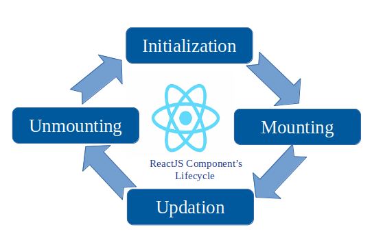

## چرخه ی حیات کامپوننت 

هر کامپوننت در ریکت یک چرخه ی حیات دارد که از لحظه ایجاد تا لحظه تخریب مداوم ان را طی میکند.
به تصویر زیر دفت کنید:



مراحل زیر به ترتیب برای هر کامپوننتی اجرا میشود
- Initialization: 
هنگام ساخت کامپوننت و مقدار دهی اولیه است اجرا میشود
- Mounting:
 هنگامی که کامپوننت به صفحه اضافه میشود اجرا میشود
- Updation: 
هنگامی که کامپوننت به هر علت رندر مجدد میشود اجرا میشود
- Unmounting: 
زمانی که کامپوننت به هر علت میخواد از ضفحه حذف شود اجرا میشود


میتوانیم نگاهی عمیق تر به چرخه حیاط کامپوننت ها بیندازیم 


در تصویر بالا مشاهده میکنید که سه متد مهم داریم 
- componentDidMount:
  هنگامی که کامپوننت به صفحه اضافه میشود اجرا میشود

- componentDidUpdate:
  هنگامی که کامپوننت به هر علت رندر مجدد میشود اجرا میشود

- componentWillUnmount:
 زمانی که کامپوننت به هر علت میخواد از ضفحه حذف شود اجرا میشود

حالا چطور میتونیم به این تابع ها دسترسی پیدا کنیم ؟؟؟

## useEffect 
هوک useEffect تمامی موارد چرخه حیاط را به ما میدهد 
 به نمونه زیر را دقت کنید:

```javascript
/**
* const [state, setState] = useState(init)
*
* {state}
* setState(new value)
*
* useEffect(callback function, dependencies)
* useEffect(() => {
*     mounting and after updating each dependencies
*     return () => {
*       unmounting and before updateing each dependencies
*     }
*   }, [states or props])
*/

useEffect(() => {
    //step 1
    console.log("mounting and after updating each dependencies");
    
    return () => {
        //step 2
        console.log("unmounting and before updating each dependencies");
    };
}, []);
```


زمانی که کامپوننت شروع به mount شدن میشود step1 اجرا میشود و زمانی که unmount میشود step2 اجرا میشود.

همچنین زمانیکه هر کدام از state ها یا prop ها تغییری پیدا کند مجدد رندر انجام شده و قبل از بروزرسانی prop | state ها step2 اجرا میشود و بعد از بروزرسانی state | prop ها step 1 اجرا میشود.

پس در واقع ما میتوانیم تمام lifecycle یک کامپوننت را با useEffect مدیریت کنیم.

:::caution نکته
معمولا ارسال درخواست داده به سرور در این هوک انجام میشود.
:::

حالا اگر به یک useEffect وابستگی داده شود چه اتفاقی رخ خواهد داد؟

```javascript
const [counter, setCounter]= useState(0);

useEffect(() => {
    //step 1
    console.log("mounting and after updating each dependencies");
    
    return () => {
        //step 2
        console.log("unmounting and before updating each dependencies");
    };
}, [counter]);
```

هوک بالا زمانی اجرا خواهد شد که counter تغییر کند.

برای دسترسی به didMount , willUnmount میتوان از روش زیر اقدام کرد و هوک را بدون وابستگی نوشت

```javascript
useEffect(() => {
    console.log("mounting");
    
    return () => {
        console.log("unmounting");
    };
}, []);
```